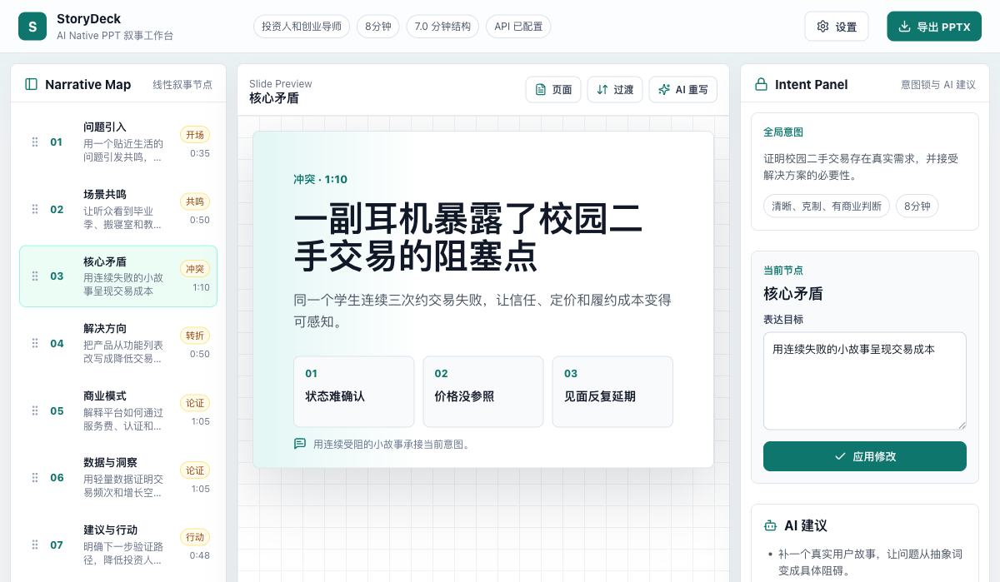
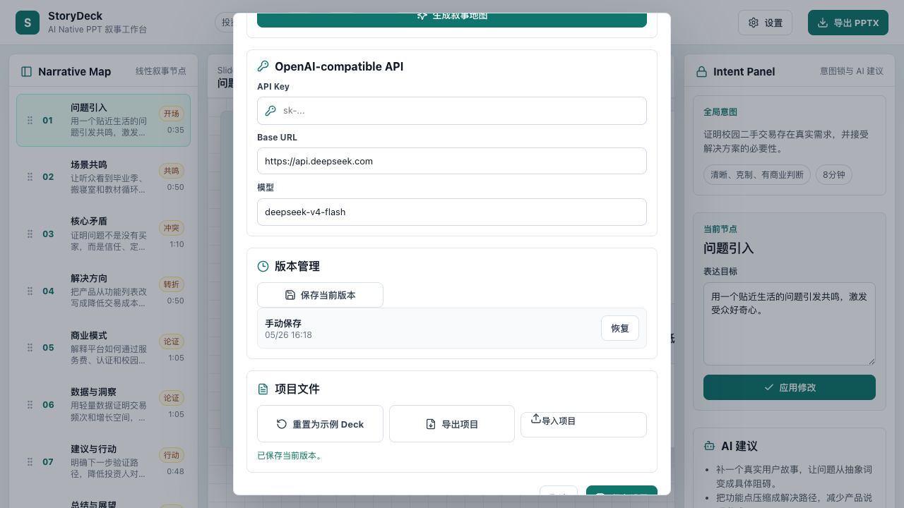
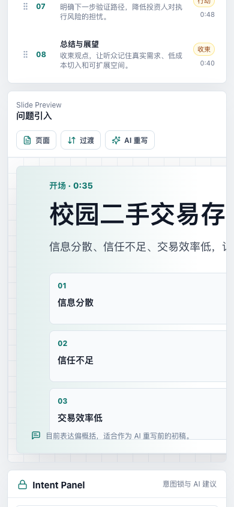

# StoryDeck

StoryDeck is an AI-native slide narrative workspace for turning a rough presentation idea into a structured, editable, and exportable deck. It is designed around a simple belief: great slides are not made one page at a time in isolation. They come from a clear story map, stable visual rules, and fast iteration on intent.

The current MVP focuses on pitch and analysis decks. It lets you define a global presentation goal, generate a narrative map, edit each node's communication intent, rewrite a single slide with an OpenAI-compatible model, render the current slide through LibreOffice for a true PPT preview, assign stable slide layouts, lock a deck template for consistency, save local versions, and export a PPTX.



## Why StoryDeck Exists

Traditional slide tools usually start from a blank canvas. That is flexible, but it often pushes the user into premature visual editing before the argument is clear. StoryDeck reverses that order.

StoryDeck treats a deck as three connected layers:

- **Narrative map**: the ordered structure of the talk, including each node's role, timing, and intent.
- **Slide content**: the title, body, bullets, and speaker note bound to each narrative node.
- **Deck template**: the stable visual language for the whole deck, generated when the narrative map is created and preserved during later edits.

This means you can adjust what a slide is trying to say without accidentally changing the deck's structure or visual system. AI is used as an editor inside that model, not as a black box that overwrites the whole presentation every time.

## Core Ideas

### 1. Intent First

Every slide is attached to an intent. Instead of editing pixels first, you describe what the page should accomplish: introduce a problem, create resonance, expose a conflict, explain a solution path, support a claim, or close with action.

The app then uses that intent as the control surface for rewriting the slide.

### 2. Narrative Map as the Source of Truth

The narrative map lives at the deck level. It is not repeated inside every slide panel. This keeps the deck's logic visible and prevents page-by-page editing from fragmenting the story.

You can reorder nodes, select a node, inspect its risk prompt, and edit the node's expression target. Each node remains bound to one slide.

### 3. Stable Templates

When a new narrative map is generated, StoryDeck first asks AI to create the story structure, then starts a separate AI request that receives that narrative map and generates the deck template. Later slide rewrites do not change that template. This protects visual consistency while allowing content to evolve.

### 4. Layout Registry

Each slide carries a layout kind such as scene statement, three-point argument, process path, or closing action. The web preview and PPTX export both read from the same layout registry, so a page's structure is not reinterpreted differently during export.

### 5. LibreOffice Preview

StoryDeck can run a local Node preview service that receives a temporary single-slide PPTX, asks LibreOffice to render it, and returns a PNG to the browser. This makes the preview match the real PPTX rendering path instead of relying only on CSS approximation.

### 6. AI as a Focused Rewrite Tool

StoryDeck supports OpenAI-compatible chat completions. The current AI flow can:

- Generate a new narrative map from a brief.
- Rewrite only the selected slide from the current node intent.
- Preserve the rest of the deck and the deck template during a single-slide rewrite.

The default test configuration uses a DeepSeek-compatible endpoint shape, but the settings are editable.

### 7. Local-First Project State

The app stores the current project and version history in browser local storage. It also supports exporting and importing `.storydeck.json` project files. API settings are kept separate from project exports.

## Features

- Linear narrative map with draggable story nodes.
- Global settings for AI configuration and narrative-map generation.
- OpenAI-compatible API settings: API key, base URL, and model name.
- AI generation for a fresh narrative map.
- Separate AI template generation after the narrative map is created.
- AI rewrite for the currently selected slide.
- Layout-aware slide preview and PPTX export.
- LibreOffice-backed current-slide preview through a local Node service.
- Fixed 16:9 slide preview, including on narrow screens.
- Stable deck template generated at deck creation time.
- Local version management with manual save and restore.
- Project export/import as `.storydeck.json`.
- PPTX export through `pptxgenjs`.
- Tests for persistence, AI generation, single-slide rewrite, template stability, and version history.

## Screenshots

### Workspace

The main workspace combines the narrative map, current slide preview, and intent panel.


### Global Settings and Version Management

The global settings modal contains narrative-map generation, API configuration, version management, and project file actions.



### Fixed 16:9 Preview on Mobile

The slide preview keeps a fixed 16:9 canvas. On narrow screens, the canvas scrolls horizontally instead of changing shape.



## How to Use

### 1. Install Dependencies

```bash
npm install
```

### 2. Start the Development Server

```bash
npm run dev
```

The app will start on `http://127.0.0.1:5173/` by default. If that port is already in use, Vite may choose the next available port.

### 3. Start the LibreOffice Preview Service

Install LibreOffice, then run the local preview server in a second terminal:

```bash
npm run preview-server
```

The preview service starts on `http://127.0.0.1:5175/` by default and looks for LibreOffice at `/Applications/LibreOffice.app/Contents/MacOS/soffice`. You can override it with:

```bash
LIBREOFFICE_PATH=/path/to/soffice npm run preview-server
```

If the service is not running, StoryDeck falls back to the editable CSS preview and shows an error in the preview status line.

### 4. Configure AI

Open **Settings** and fill in:

- **API Key**: your OpenAI-compatible API key.
- **Base URL**: for example `https://api.deepseek.com`.
- **Model**: for example `deepseek-v4-flash`.

API settings are stored locally in the browser and are not included in exported project files.

### 5. Generate a Narrative Map

In **Settings**, use **New Narrative Map**:

1. Enter a topic.
2. Define the audience.
3. Describe the deck goal.
4. Set the target duration.
5. Click **Generate Narrative Map**.

StoryDeck creates a deck in two AI calls: the first call generates narrative nodes and slides, then a second fresh AI call receives that narrative map and generates the deck template.

### 6. Rewrite a Single Slide

1. Select a node in the narrative map.
2. Edit the expression target in the intent panel.
3. Click **AI Rewrite** in the slide toolbar.

Only the selected slide's title, body, bullets, and speaker note are rewritten. The narrative structure, other slides, and deck template stay unchanged.

### 7. Save and Restore Versions

Open **Settings** and use **Version Management**:

- Click **Save Current Version** before a larger rewrite or structural change.
- Add a version name and change summary when you want the restore point to be self-explanatory.
- Click **Restore** on a saved version to return to that snapshot.
- Before restoring, StoryDeck automatically saves the current state as **恢复前自动保存** so the latest work is not lost.

Version history is local to the browser.

### 8. Export a PPTX

Click **Export PPTX** in the top bar. StoryDeck exports the deck using the current content and the locked deck template.

### 9. Export or Import a Project File

Open **Settings** and use **Project File**:

- **Export Project** saves a `.storydeck.json` file.
- **Import Project** restores a previously exported StoryDeck project.
- **Reset to Example Deck** returns to the bundled sample.

## Project Structure

```text
StoryDeck/
  src/
    App.tsx                    # Main React shell and UI flows
    data/seedDeck.ts           # Bundled example deck
    lib/aiGeneration.ts        # OpenAI-compatible deck and slide generation
    lib/aiSettings.ts          # Local AI settings persistence
    lib/deckLogic.ts           # Narrative and slide state transitions
    lib/deckPersistence.ts     # Project save/import/export helpers
    lib/libreOfficePreview.ts  # Browser client for the local preview renderer
    lib/pptxExport.ts          # Shared PPTX generation for export and preview
    lib/slideLayout.ts         # Shared web/PPTX layout registry
    lib/deckTemplate.ts        # Stable deck template creation and migration
    lib/deckVersions.ts        # Local version history
    styles.css                 # App layout and fixed 16:9 slide canvas
  server/
    preview-server.mjs         # Local Node service that renders PPTX via LibreOffice
  docs/images/                 # README screenshots
  output/playwright/           # Local verification screenshots
```

## Available Scripts

```bash
npm run dev
npm run preview-server
npm test
npm run lint
npm run build
```

- `npm run dev` starts the Vite development server.
- `npm run preview-server` starts the local LibreOffice rendering service.
- `npm test` runs the Vitest suite.
- `npm run lint` runs TypeScript project checks.
- `npm run build` creates a production build.

## AI Provider Notes

StoryDeck calls an OpenAI-compatible `/v1/chat/completions` API. For DeepSeek during local browser development, requests to `https://api.deepseek.com` are routed through the local Vite proxy path `/deepseek/v1/chat/completions`.

The app expects JSON responses for deck generation and slide rewrites. The prompts explicitly ask the model not to invent statistics unless the user provided them.

## Current MVP Status

Implemented:

- Narrative-map based editing.
- Global AI settings.
- AI narrative-map generation.
- Separate AI-generated template creation from the narrative map.
- AI single-slide rewrite.
- LibreOffice-backed current-slide preview.
- Fixed 16:9 preview.
- Layout registry v1 for statement, three-point, process, and closing slides.
- Stable deck template.
- Local project persistence.
- Project export/import.
- Named version history with summaries and pre-restore autosave.
- PPTX export.

Planned next:

- Better template and layout selection controls.
- Undo stack for quick local reversions.
- Image and evidence attachment per slide.
- Cloud sync or Git-backed project history.

## Privacy and Local Data

StoryDeck is currently local-first:

- Project state is stored in browser local storage.
- Version history is stored in browser local storage.
- API settings are stored separately from exported project files.
- Exported `.storydeck.json` files do not include API keys.

Be careful when using real API keys in browser-based prototypes. For production use, route AI calls through a backend or trusted edge function.

## License

No license has been selected yet. Add a license before distributing or accepting external contributions.
