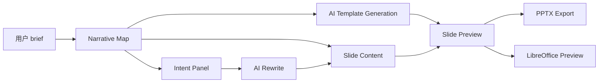

# AI Native PPT 编辑器产品设计说明

## 0. 题目理解

传统演示文稿工具默认用户会“手动逐页制作”。因此它们的核心界面围绕页面列表、画布、对象属性、模板套用展开。这个设计前提在 AI 生成工作流下开始失效。

用户现在经常从一句话、一个 brief 或一段现有材料开始，让 AI 先生成初稿，再进行判断、删改、重组和打磨。此时用户真正困难的不是“怎么画一个矩形”，而是：

- AI 生成的叙事结构是否合理？
- 每一页到底想表达什么？
- 我修改一页意图后，内容能不能跟着调整？
- 我重排故事顺序后，整套 Deck 是否还连贯？
- 我能不能让 AI 局部协作，而不是每次重做一整份 PPT？

因此，一个 AI Native PPT 编辑器的核心交互不应该只是“传统编辑器 + AI 按钮”，而应该把表达结构、页面意图、AI 重写和视觉一致性作为同一个系统来设计。

我的方案是 **StoryDeck**：以 Narrative Map 为中心的 AI Native PPT 叙事工作台。

## 1. 行为观察与用户思考

### 1.1 目标用户

本产品优先服务三类用户：

| 用户 | 典型场景 | 核心任务 |
| --- | --- | --- |
| 创业者 / 路演者 | 准备投资人 pitch、产品发布、Demo Day | 把想法讲成有说服力的故事 |
| 产品 / 策略 / 咨询岗位 | 做业务汇报、方案汇报、分析型 Deck | 快速组织论证结构，并反复调整逻辑顺序 |
| 学生 / 训练营参与者 | 从作业题目、课堂材料或研究主题生成展示稿 | 在 AI 初稿基础上形成自己的判断和表达 |

这些用户共同特点是：他们并不只是需要“更快做出漂亮页面”，而是需要更快形成一套可以被听众理解和接受的表达结构。

### 1.2 真实使用行为

观察一个常见的 AI 做 PPT 流程：

1. 用户在 AI 工具里输入一句话或一段材料。
2. AI 生成一份大纲或 PPT 初稿。
3. 用户发现内容看似完整，但结构不一定符合自己的真实表达目标。
4. 用户把内容复制到 PPT 工具里，开始逐页修改。
5. 修改过程中，用户不断在“大纲结构”和“页面内容”之间来回切换。
6. 一旦重排顺序或修改某页观点，很多页面标题、正文、过渡和视觉模板都需要手动维护。

这个过程里，AI 提供了初稿，但没有持续理解用户后续的判断。用户最后仍然回到传统编辑器里做大量手工修补。

### 1.3 核心痛点

#### 痛点一：AI 生成的是页面，但用户需要调整的是叙事

传统 PPT 编辑器把“页面”作为最小工作单元。但 AI 初稿出来后，用户最先判断的是：

- 顺序对不对？
- 哪一页应该承担什么叙事角色？
- 有没有过早进入解决方案？
- 有没有缺少冲突、证据或行动建议？

这些问题发生在结构层，而不是像素层。

#### 痛点二：表达意图无法被工具保存

一页 slide 往往有隐含意图，例如“让投资人意识到问题真实存在”或“用一个具体故事降低抽象感”。传统工具只保存页面文本和图形，不保存这页为什么存在。

结果是用户下次让 AI 重写时，AI 只能看到表面内容，很难理解这页在整套 Deck 中的任务。

#### 痛点三：AI 能力与编辑体验割裂

很多已有产品把 AI 做成侧边栏或一次性生成按钮。AI 生成完之后，用户还是回到逐页编辑器。AI 不知道用户刚刚拖动了叙事顺序，也不知道用户为什么改了某页目标。

#### 痛点四：预览和导出不一致会破坏信任

PPT 是交付型文件。用户最终关心的是导出到 PowerPoint 后是否一致。如果 Web 预览和真实 PPT 渲染差异巨大，用户很难信任这个编辑器。

## 2. 产品设计思路

### 2.1 核心判断

AI Native PPT 编辑器不应该把 AI 定位成“帮你填内容的助手”，也不应该完全让 AI 主导成品。对演示文稿来说，AI 更适合成为 **结构化协作者**：

- 用户负责判断目标、听众、叙事取舍。
- AI 负责根据结构化意图生成、重写、补全和调整表达。
- 工具负责保存结构、意图、模板和版本，让 AI 协作发生在稳定上下文中。

### 2.2 核心亮点一：Narrative Map 叙事地图

StoryDeck 把 PPT 从“页面列表”重新定义为“叙事节点列表”。

每个节点包含：

- 标题
- 表达意图
- 叙事角色：开场、共鸣、冲突、论证、转折、行动、收束
- 建议时长
- 绑定的 slide
- 结构风险提示

用户可以直接拖拽 Narrative Map 调整故事顺序，而不是先在页面缩略图里猜测逻辑。

这种交互回答了题目里的关键问题：PPT 不一定一开始就是“一页一页”的。对 AI 生成工作流来说，它首先应该是一个可以整体调整的表达结构。

### 2.3 核心亮点二：Intent-aware Editing 意图感知编辑

每个叙事节点都绑定一个表达意图。用户不是直接要求 AI “把这页写好看点”，而是告诉系统：

```text
这一页要让听众意识到校园二手交易中的信任和履约成本。
```

AI 重写时会读取：

- 全局 Deck 目标
- 当前节点角色
- 当前节点表达意图
- 当前页面内容
- 锁定模板和布局约束

这样 AI 的输出不再是孤立文案，而是针对这页在整套 Deck 中的任务进行局部改写。

### 2.4 产品结构

StoryDeck 当前由三个主工作区和一个全局设置区组成：

| 模块 | 职责 |
| --- | --- |
| Narrative Map | 管理 Deck 结构、节点顺序、节点角色和表达意图 |
| Slide Preview | 查看当前页，切换布局，触发 AI 重写，查看真实 PPT 预览状态 |
| Intent Panel | 编辑当前节点表达目标，对比 AI 建议稿，应用或放弃改写 |
| Global Settings | 生成新叙事地图、配置 AI、管理模板、保存/恢复版本、导入/导出项目 |

模块关系如下：



设计重点不是增加更多编辑工具，而是让结构、意图、AI 和页面保持联动。

## 3. 核心功能设计

### 3.1 叙事地图生成

用户在全局设置中输入：

- 主题
- 听众
- Deck 目标
- 目标时长

AI 首先生成 Narrative Map 和页面初稿。这个阶段不直接把用户带进传统页面编辑器，而是让用户先审视故事结构。

### 3.2 模板生成独立成第二个 AI 对话

为了减少 AI 同时处理太多任务导致的不稳定，StoryDeck 把“生成叙事地图”和“生成模板”拆成两个对话：

1. 第一个对话：只生成叙事节点和页面内容，不输出 template。
2. 第二个对话：接收叙事地图 JSON，只生成 Deck 模板。

这样模板是在整套故事确定之后生成的，并且后续单页改写不会自动改变模板。

### 3.3 单页布局选择

每页有布局类型：

- 场景陈述
- 三点论证
- 流程路径
- 行动收束

用户可以在预览工具栏切换当前页布局。Web 预览和 PPTX 导出共享同一个 layout registry，减少“浏览器里看着对，导出就变了”的风险。

### 3.4 AI 重写对比

AI 重写不会立即覆盖当前页，而是先生成建议稿。用户可以对比：

- 原稿
- AI 建议稿

确认后再应用。这体现了对演示文稿场景的判断：AI 不应该直接替用户决定最终表达，用户仍然是叙事判断者。

### 3.5 版本管理和撤销

AI Native 工作流中，用户会频繁试错。StoryDeck 提供：

- 手动保存版本
- 恢复前自动保存
- 模板重生成前自动保存
- 顶部撤销按钮

这让用户更敢于让 AI 参与修改，因为每次尝试都可以回退。

### 3.6 LibreOffice 真实预览

StoryDeck 通过本地 Node 服务调用 LibreOffice 渲染单页 PPTX，返回 PNG 给前端。这个设计解决了 AI PPT 工具很常见的信任问题：用户需要知道最终导出的 PowerPoint 是否真的和预览一致。

## 4. 用户完整动线

### 4.1 新产品形态下的路径

1. **产生需求**
   - 用户有一个主题，例如“校园二手交易平台路演”。

2. **输入 brief**
   - 用户在全局设置里填写主题、听众、目标和时长。

3. **AI 生成叙事地图**
   - 系统生成 Narrative Map，而不是直接让用户进入逐页画布。

4. **用户审视结构**
   - 用户查看节点顺序、每个节点角色和表达意图。
   - 如有风险，系统提示结构问题。

5. **AI 生成稳定模板**
   - 系统基于叙事地图生成 Deck 模板并锁定。

6. **用户编辑表达意图**
   - 用户选中某个节点，修改“这一页要表达什么”。

7. **AI 局部重写**
   - AI 根据当前节点意图生成单页建议稿。
   - 用户对比原稿和建议稿后决定是否应用。

8. **用户调整布局**
   - 用户根据叙事任务选择场景陈述、三点论证、流程路径或行动收束。

9. **用户预览真实 PPT 效果**
   - 启动 LibreOffice 预览服务后，当前页可通过真实 PPT 渲染路径预览。

10. **保存版本 / 撤销 / 导出**
    - 用户保存版本、撤销试错、导出 PPTX。

### 4.2 与传统编辑器的关键差异

| 传统 PPT 编辑器 | StoryDeck |
| --- | --- |
| 起点是空白页或模板 | 起点是一句话 brief 和 AI 生成的叙事地图 |
| 核心对象是 slide | 核心对象是 narrative node |
| 用户逐页编辑内容和排版 | 用户先调整结构和表达意图，再局部重写 |
| AI 多是一次性生成或侧边栏助手 | AI 持续读取结构化上下文进行协作 |
| 模板常被页面编辑打散 | 模板生成后锁定，后续改内容不改模板 |
| 预览可能和导出不一致 | 通过 LibreOffice 接近真实 PPT 渲染 |

## 5. Demo 与作业要求映射

| 作业要求 | Demo 中的对应实现 |
| --- | --- |
| 行为观察与用户思考 | 本文第 1 节定义目标用户、行为路径和核心痛点 |
| 产品设计思路 | Narrative Map、Intent-aware Editing、模板锁定、LibreOffice 预览 |
| 用户完整动线 | 本文第 4 节，以及 `demo-walkthrough.md` |
| 可交互原型 | React + Vite Demo，支持生成、编辑、预览、撤销、导出 |

## 6. 取舍与后续方向

### 当前 MVP 的取舍

- 没有追求完整 PowerPoint 编辑器能力，而是聚焦 AI Native 工作流的核心交互。
- 没有做移动端适配，因为目标使用场景是桌面端生产力工具。
- 没有把 AI 请求放到生产级后端，当前仍是本地原型。
- 没有覆盖所有页面素材类型，先确保文字、结构、布局、模板和导出链路成立。

### 下一步

1. **每页图片和证据素材**
   - 让每个节点不仅有观点，也能挂载证据截图、数据图或引用来源。

2. **预览/导出回归检查**
   - 自动生成 PPTX，调用 LibreOffice 渲染，检查尺寸、非空和关键元素，避免预览导出漂移。

3. **本地 Node AI 服务**
   - 把 API key 和 AI 请求迁到本地服务，降低浏览器原型中暴露 key 的风险。

4. **更强的结构诊断**
   - 让系统识别过早进入商业模式、缺少冲突、缺少行动建议等叙事风险。

## 7. 结论

StoryDeck 的核心不是“让 AI 更快生成 PPT”，而是重新定义 AI 时代 PPT 编辑器的工作流：

> 用户不再从空白页逐页制作，而是在叙事结构层持续表达判断；AI 不再只是生成初稿，而是在结构化意图中持续协作；工具不再只保存页面，而是保存结构、意图、模板和版本。

这才是我认为 AI Native PPT 编辑器应该重新思考的核心交互范式。

